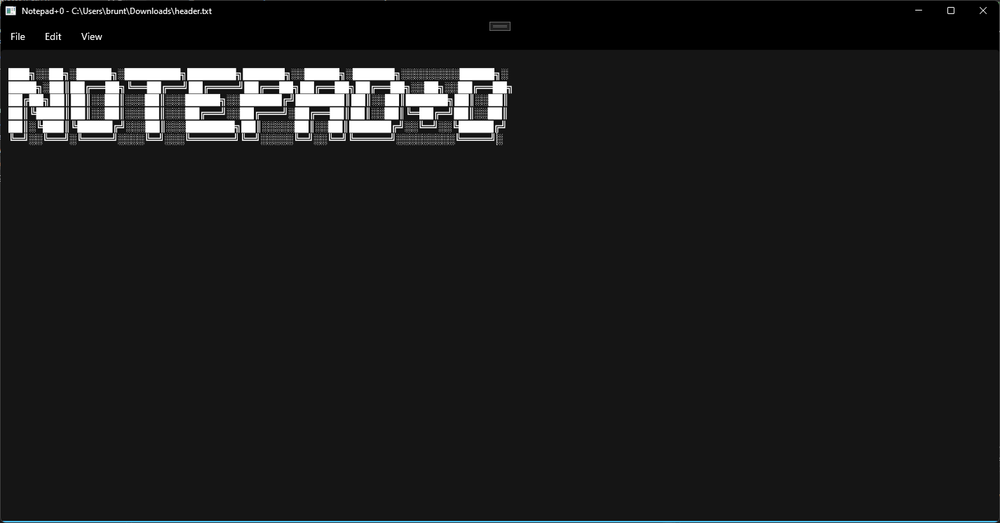

# Notepad+0
Notepad, and nothing more. 

In light of Microsoft's adding tabs, "Define with Bing" and, more recently, ["AI experiences"](https://blogs.windows.com/windows-insider/2024/11/06/new-ai-experiences-for-paint-and-notepad-begin-rolling-out-to-windows-insiders/), notepad is straying from what it used to be. This app looks and feels like the default Windows 11 experience, without the [ens***tification](https://en.wikipedia.org/wiki/Enshittification). 

## Goals
A simple text editor, and nothing more. Notably, this project does not aim to implement any of the following: 
* Tabs
* Any internet-enabled functionality
* AI 

## Installation
Packaged builds are not available at this time. 

## Build From Source

Requires .NET 8 and the Windows App SDK. 

## License 

Published under the [MIT License](./LICENSE.md). 